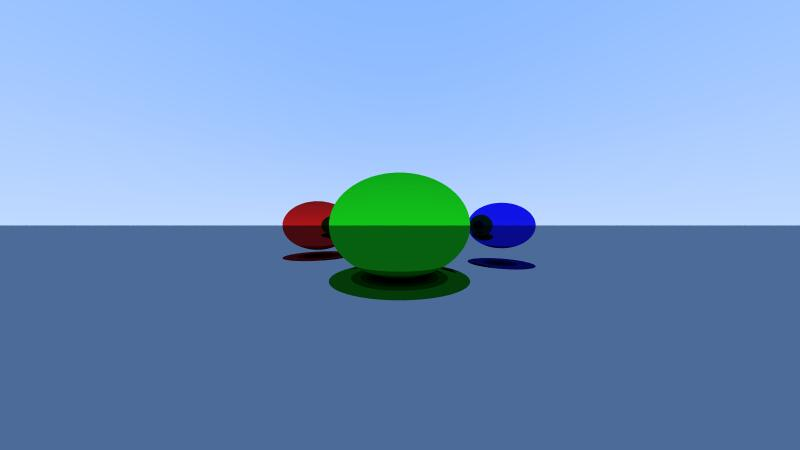
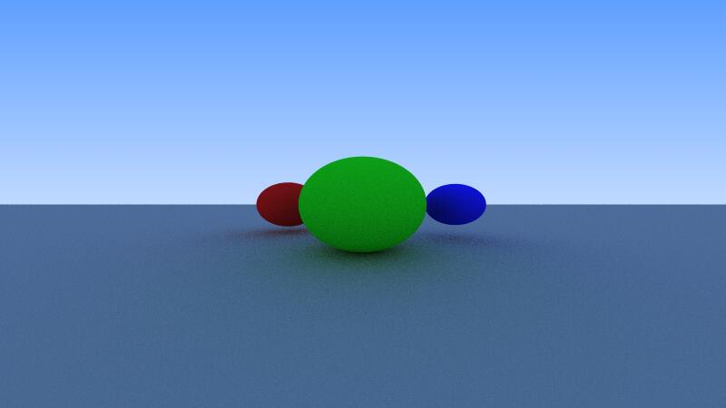
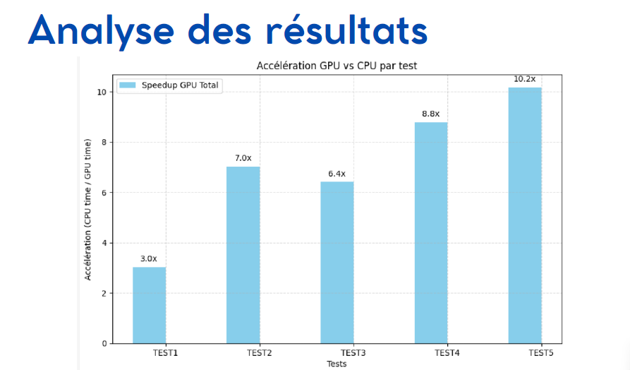

# Ray Tracing in C++ / CUDA  

## Project Overview
This project was developed as part of the **CHPS0802 – GPU Programming** module at the University of Reims Champagne-Ardenne (URCA).  
The goal was to design a 3D rendering engine using **Ray Tracing**, first implemented in **sequential C++**, then migrated to **CUDA** to leverage massive GPU parallelism.  

---

## 🎯 Objectives  
- Understand the basics of Ray Tracing and realistic 3D rendering.  
- Implement a modular **object-oriented architecture** in C++ (sequential version).  
- Adapt the project to **CUDA**, overcoming GPU programming constraints.  
- Compare the performance of CPU vs GPU implementations.  

---

## 🖥️ Sequential Implementation (C++)  
- **Object-Oriented Architecture**:  
  - `Ray`, `Point3D`, `Vector3D`, `Color`, `Material`  
  - `Object` (abstract class) with derived classes: `Sphere`, `Triangle`, `Plane`  
  - `Scene` (handles objects, lights, intersections)  
  - `Camera` (generates rays from screen coordinates)  

- **Key Features**:  
  - Memory management with `std::shared_ptr`.  
  - Recursive `ray_color()` function with maximum depth limit.  
  - Anti-aliasing via stochastic sampling.  
  - Image export in `.ppm` format.  

📸 *Example output (sequential version)*:  
  

---

## ⚡ GPU Implementation (CUDA)  
- Each pixel is computed independently → **1 thread = 1 pixel**.  
- **Pipeline**:  
  1. Scene construction on the CPU.  
  2. Data transfer to GPU (VRAM).  
  3. Kernel execution (`render_kernel`).  
  4. Result retrieval and `.ppm` image export.  

### 🔧 Challenges & Solutions  
- ❌ **Polymorphism not supported** → replaced with `struct + enum + union`.  
- ❌ **Recursion inefficient** → replaced by an iterative `ray_color()`.  
- ❌ **`rand()` not thread-safe** → replaced with **CURAND** (per-thread RNG).  
- ❌ **STL restrictions (`shared_ptr`)** → replaced by `cudaMalloc` + `cudaMemcpy`.  

📸 *Example output (CUDA version)*:  
  

---

## 📊 Results & Performance  
  

## 🚀 Future Improvements  
- Add new materials (metal, glass, transparency).  
- Support for volumetric lighting and refraction.  
- Integration with **OpenGL** for real-time interactive rendering.  
- **Multi-GPU support** for complex scenes.  

---

## 👩‍💻 Author  
Project by **Wejdane BOUCHHIOUA**  
Master 1 – High Performance Computing & Simulation (CHPS)  
University of Reims Champagne-Ardenne – 2024/2025  

---

